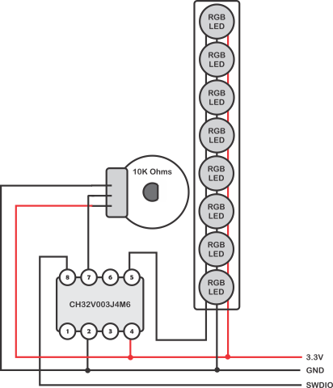

RGB Larson Scanner
------------------

This is the code for my RGB Larson scanner on the 8 pin CH32003V. A simple
schematic is shown below.



This uses an [8 pixel stick](https://www.amazon.com/dp/B09YTLY6CK) of WS2812
RGB LEDs, a 10K ohm potentiometer, and the CH32V003J4M6 (CH32V003 in an 8 pin
package). You will need a programmer to program the chip.

These parts came in 
[Hackerbox #0116: RISC is good](https://hackerboxes.com/collections/past-hackerboxes/products/hackerbox-0116-risc-is-good) along with some other stuff.
Overall I can easily recommend subscribing to these boxes as every month there
are always interesting things to do, espcially if you dig into the parts.

There are 6 usable I/Os (5 if you don't want to lose the SWDIO pin to I/O) of
which this circuit uses two, PC1 (pin 5) and C4 (pin 7, acting as ADC1 
channel 2). I wrote the C code and was using the 
[ch32fun](https://github.com/cnlohr/ch32fun) repo as a guide. If you copy
this repo into the examples directory of that repo you can just type `make`
and things should just work.

The original "Larson" scanner was on the front of self driving car named
"Kit" in the TV drama "Night Rider" the folks at Evil Mad Science did a
[write up.](https://wiki.evilmadscientist.com/Larson_Scanner)

## Theory of Operation

Unlike the original (which was RED LEDs) this one can be any color in the
RGB universe, but I thought it would be boring to have it just one color so
when the moving LED changes direction it also changes color! The LEDs are,
in theory, capable of displaying 16M colors but I limit myself to the eight
which are the number of combinations you can make from fully lit R, G, and
B elements. 

The WS2812 LED uses a self clocked serial protocol to tell the control 
chip what to do. The timing of the protocol uses asymmetric timings (50%
asymmetry) of .4uS and .8uS. You can divide a single bit time into three
"slots" of 0.4uS and then send 0b100 for a '0' bit and 0b110 for a '1' bit.
Each three bit sequence is a baud which is sent at 3 \* .4uS or 1.2uS
per baud. That is an effective 833,333 kB/s. So here is the full math:

```
One datum bit (0b100 or 0b110) is 3 baud bits.
    one color is 8 datums or 24 baud bits.
        three colors is one pixel or 72 baud bits.
			eight pixels is 24 colors or 576 total baud bits.
```
If you set the bits in the same position in an 8 bit byte in memory, and 
have a buffer of 576 bytes, this "wastes" the other 7 bits but can be
dumped to the I/O port which will generate an accurate bit stream to the
pixel.  Of note, this chip only has 2048 bytes of RAM so using 576 of 
them for a buffer means you only have 1472 left for other purposes. Keep 
that in mind.


Setting the bits in the buffer can be done in a loop:
```c
#define PIXELS 8
#define COLORS (PIXELS * 3)
#define BUFLEN (COLORS * 24)

uint8_t buf[BUFLEN];
uint8_t pixel[COLORS];

void
build_buffer() {
	/* 
	 * The 8 pin CH32V003 brings out C1 (bit position 2)
	 * to pin 5 of the package. So we're using the constant 2
	 * here, and (pixel >> 6) as the on/off bit for our pixels
	 * (rather than bit 0)
	 */

    /* For each 'color' */
    for (i = 0,ndx = 0; i < COLORS; i++) {
        uint8_t p = pixel[i];
        /* For each bit in the color */
        for (b = 0; b < 8; b++) {
            buf[ndx++] = 2;
            buf[ndx++] = (p & 0x80) >> 6;
            buf[ndx++] = 0;
			p = p << 1;
        }
    }
    /* buffer is ready to go (one pixel's worth) */
}
```

To update the color of all 8 pixels, you first reset the controller and
then you dump that buffer out of the port. To reset the controller you
hold its `DATAIN` line low for 50uS (or more). After reset, the first
LED will use 24 bits to set itself and then pass on all future bits, Etc.
until the last LED is programmed. At which point any future bits will just
get tossed to the wind until you reset the controller again. 

The result will be 8 pixels set to the colors you set up.

## So how long does it take?

We could get fancy and set up the DMA engine to copy that buffer out to
port C with 0.4uS between each byte, but that is kind of complex. What if
we just send them out in a loop? How fast would that be? 

Well I could count cycles and what not, but what I did was I set PC2 high (pin
6 on the chip) when I started sending out the bits, and then reset it back 
low when I was done. Then I looked at pin 5 and pin 6 on my oscilloscope
to see how long was it between baud bits.


If you look carefully  the period for channel 2 to be positive is 167 uS.

The [WS2812 data sheet](https://www.digikey.com/en/htmldatasheets/production/1829370/0/0/1/ws2812b)
says that the high and low times of each 'bit' should add up to 1.25uS +/-
.15uS. So if our loop was "perfect" it would take 240uS to dump all 576
bytes.

If we take 240 uS and subtract 167 we get 73 microseconds of delay to add
across 576 iterations of our loop, so about 7.9uS per iteration. Now the
datasheet says each bit can be +/- .15 uS, so that is +/- 24uS overall,
suggesting that if the loop was between 216uS (as fast as possible)
and 264 uS (as slow  as possible) we'd be okay. I'm not one to test 
the boundaries that hard so I was shooting for being between +/- 10uS
of our target.

I added five 'NOP' instructions (assembly instructions that take time to
execute but don't actually do any computation or change any state) and the
loop was 214.9 uS, with six 'NOP' instructions it was 238.6 or nearly 239.
So yay, add six NOPs and we're in business.
 
## Dynamic speed adjustment

The logic of a Larson scanner is pretty straight forward but how fast
should it run? Turns out that there is an analog to digital converter (ADC) on
this chip so we can "input" a value through a variable resistor (also
called a potentiometer).

Channel 2 of the ADC is selectable on port PC4 (chip pin 6) so I hooked up
the variable resistor's "wiper" (the center pin) to pin 6, and the outer
pins across 3.3v and ground. Now when you turn the potentiometer's shaft,
the voltage at the input pin will vary between 0 and 3.3 volts.

The ADC is a "10 bit" converter, so it converts its input into one of
1024 value, where 0x00 represents 0V and 0x3FF represents 3.3V. I have
configured the ADC to run continuously, constantly sampling the value
and dumping a number between 0 and 1023 into the ADC's data register.

In the loop which is changing which LED is lit, the value from ADC is used
to set the delay in mS between one position at the next. At '0' the loop
runs continuously, at 1023 it takes 1.023 seconds between steps. So
quite the range.

## Other Ideas

There are lots of other things that can be done with this simple program. 

You might create a snake like trail of 3 pixels moving back and forth, or
two colors moving in opposite directions. There are dozens of
visualizations that people have done on these sorts of LED strips.

All in all it was a fun project and I hadn't really had a chance to play
with the CH32V series chips yet so this gave me a good excuse.

Have Fun!
